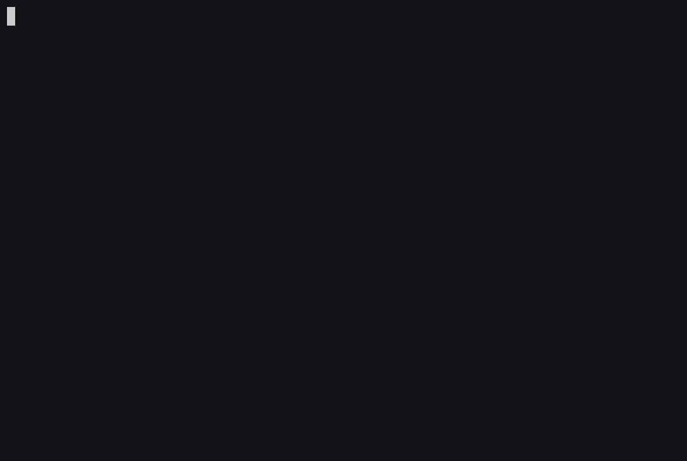

# dirstat-rs

2X faster than du

4X faster than ncdu, dutree, dua, du-dust

6X faster than windirstat

(On 4-core hyperthreaded cpu)

    C:\Users\LUNA>ds --help
    dirstat-rs 0.2.2
    scullionw <scuw1801@usherbrooke.ca>
    A disk usage cli similar to windirstat

    USAGE:
        ds [FLAGS] [OPTIONS] [target_dir]

    FLAGS:
        -a               Apparent size on disk.
        -h, --help       Prints help information
        -j               Output sorted json.
        -V, --version    Prints version information

    OPTIONS:
        -d <max_depth>          Maximum recursion depth in directory. [default: 1]
        -m <min_percent>        Threshold that determines if entry is worth being shown. Between 0-100 % of dir size.
                                [default: 0.1]

    ARGS:
        <target_dir>
        
        
# Installation
Crates.io:

        cargo install dirstat-rs
        
or latest from git:

        cargo install --git "https://github.com/scullionw/dirstat-rs"
        
or from source:

        cargo build --release
        sudo chmod +x /target/release/ds
        sudo cp /target/release/ds /usr/local/bin/

# Usage

 1. Current directory:
    
        $ ds
    
 2. Specific path
 
        $ ds PATH

 3. Choose depth
 
        $ ds -d 3

 4. Show apparent size on disk

        $ ds PATH

    
    
    
    
